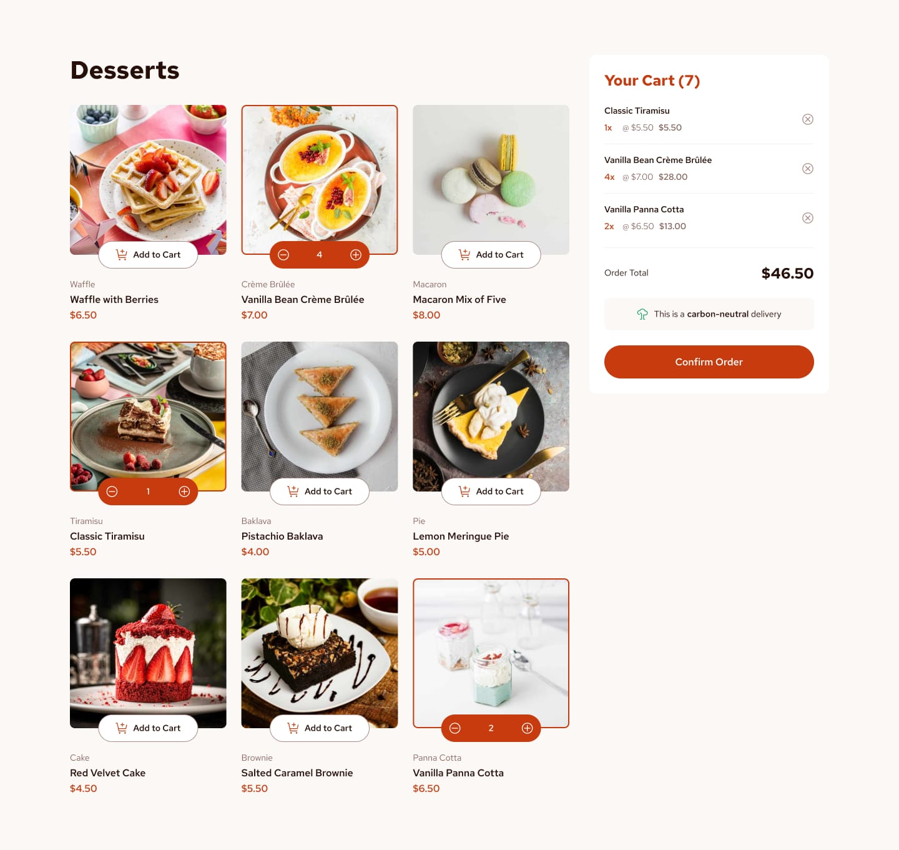

# 🍰 Chisom's Tasty Cart

A simple and elegant dessert product list with a functional shopping cart, built using **React JS**. Designed to closely match a high-fidelity UI mockup and demonstrate component-based structure, state management, and dynamic rendering.    

---

## 🖼️ Project Preview
https://chisom-tasty-cart.vercel.app



---

## 🚀 Features

- 🍩 Browse a list of dessert products from `data.json`
- 🛒 Add items to a cart with dynamic quantity controls
- ➕ Increment/➖ Decrement item quantities
- ❌ Remove items from the cart
- 📦 Live order total calculation

---

## 🛠️ Tech Stack

- **React** (Functional components + hooks)
- **CSS** (modular component styles)
- **Lucide-react** for icons
- **Local JSON data** (for products)

---

## 📦 Installation

1. **Clone the repository**
```bash
git clone https://github.com/ruthchisom/tasty-cart.git
cd tasty-cart
````

2. **Install dependencies**

```bash
npm install
```

3. **Run the app**

```bash
npm start
```

The app will start on `http://localhost:3000`.

---

## 🔧 Customization

* **Add/Edit products** via `src/data/data.json`
* **Update images** in `/public/assets/` folder
* **Customize styles** in the CSS files under `components/`

---

## ✅ To-Do

* [ ] Make it fully responsive
* [ ] Implement persistent cart with localStorage
* [ ] Add checkout integration

---

## 🧑‍💻 Author

**Ruth Chisom**
*Built with love for desserts and clean UIs*
@techychisom across social media

---

## 📄 License

This project is open source and available under the [MIT License](LICENSE).

```

---

```
